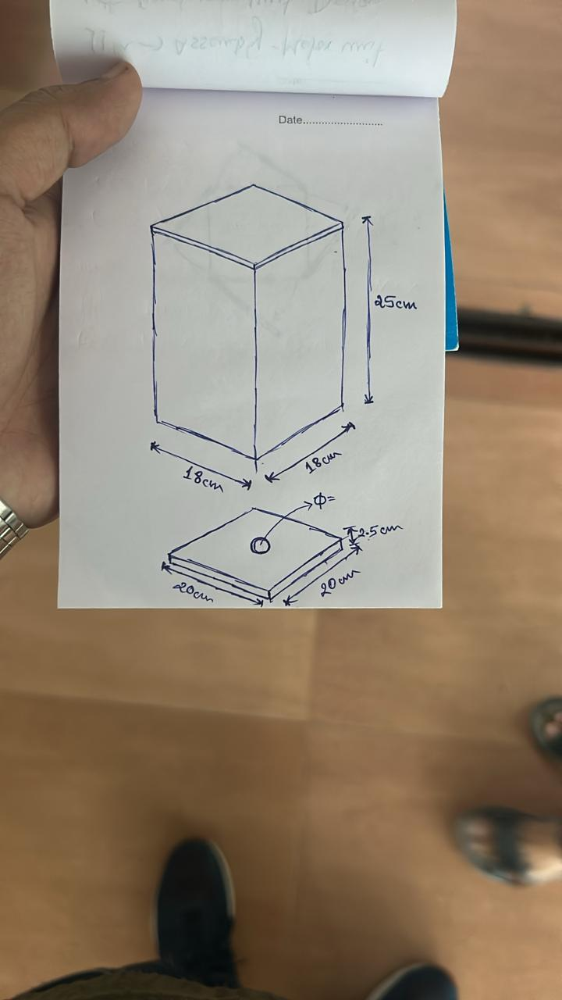

# Ankaja - A Hardware based Random Number Generator using MYOSA kit
     
>“One-line project tagline.”

---

## Acknowledgements

We would like to thank the MYOSA Innovation Challenge organizers for providing the MYOSA development platform and the opportunity to explore TRNG.
We also acknowledge the guidance and support provided by our mentor **Dr. Rupam Goswami Sir** throughout this project.

---

## Overview

**Ankaja** is an innovative hardware-software system designed to generate true random numbers by combining natural stochastic electronic noise with unpredictable physical parameters. 

**What problem does it solve?**
- **Overcomes the predictability** of purely algorithmic pseudo-random number generators.
- Provides a **low analog computational cost** solution for capturing random electronic fluctuations.
- Serves as a customized hardware source for true randomness, perfectly **tailored for low-to-moderate priority security applications.**

**Key Features**
- **Analog Noise Generation:** Utilizes an IRF540N n-channel MOSFET as a switch to generate high-frequency noise signals.
- **Multi-Sensor Aggregation:** Captures physical parameters like Electronic noise using MOSFET, RGB light, ambient light, temperature, gyroscope data (in x, y, z), air particles,  simultaneously.
- **Custom Chaotic Environment:** Employs a physical mirrored box with rotating LEDs, moving discs, and agitated air particles to create a highly dynamic sensory input.
- **Bit-Picking Algorithm:** Uses an array-based system to process sensor data into true random numbers.  
---

## Demo / Examples

### **Images**

   
  <i>Black Box</i>

### **Videos**
<video controls width="100%">
  <source src="/myosa-demo.mp4" type="video/mp4">
</video>

---

## Features (Detailed)

### **1. Analog Noise Generator Circuit**

Electronic noise in MOSFETs is naturally stochastic.   
- Circuit Design: The Drain (D) terminal is connected to +5V using a 2kΩ pull-up resistor.
- Input: A 1kHz frequency pulse signal with an amplitude of 4V is applied at the Gate (G).
- Output: The resulting noise signal is harvested from the Drain terminal and fed directly to the 12-bit ADC of the MYOSA motherboard.

### **2. Chaotic Hardware Environment**

To gather unpredictable digital data, a 45 cm x 45 cm box with a rough mirrored inner wall houses multiple stimuli:   
- Visual Disturbance: A motor rotates colored LEDs and sweeps a disc around the APDS9960 sensor to trigger random RGB and gesture data.
- Particle Agitation: A PC fan continuously blows air inside the box, scattering particles for the PMS5003 sensor to detect.
- Environmental Metrics: External BMP180 and CCS811 sensors gather ambient temperature, pressure, humidity, and volatile organic compounds to add extra environmental entropy.

### **3. Digital Processing & BCD Clamping**

- Data Collection: Sensors communicate via I2C and UART (PMS5003), sending 8-bit digital data packets.
- Array Initialization: The system accumulates two sets of 8-bit data into a 16-bit variable for each sensor.
- Random Bit Selection: A software "BitPicker" randomly selects bits from across the sensor arrays.
- BCD Clamping: The 16 random bits are grouped, and a modulo operator (%10) limits the decimal equivalent of the chunks to 9 (preventing hex values up to 15), finalizing the 16-bit random output.
---

## Usage Instructions
---

## Tech Stack

- **Core Controller** - MYOSA Motherboard
- **Actuators**
  - 5V DC Motor (LED Spinner),
  - 5V DC Motor (Particle Fan),
  - OLED Display
- **Sensors**
  - APDS9960 (RGB Sensor)
  - **PMS5003** - (Particle Sensor)
  - **Analog Hardware** - IRF540N MOSFET
---
## File Stucture
---
## Requirements / Installation

### **Hardware Requirements**

### **Software Requirements**
---
